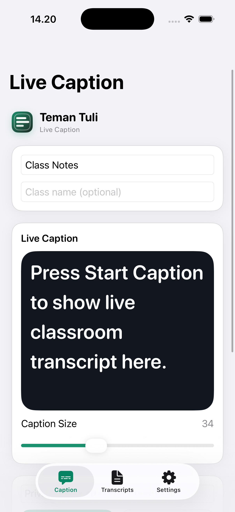
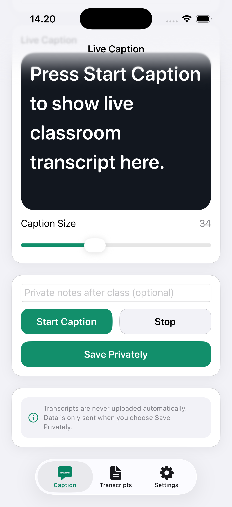
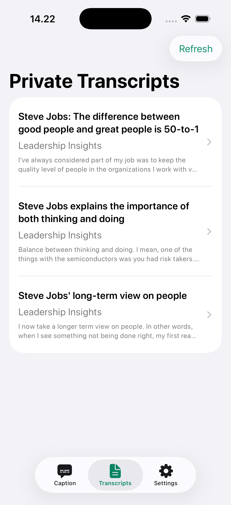
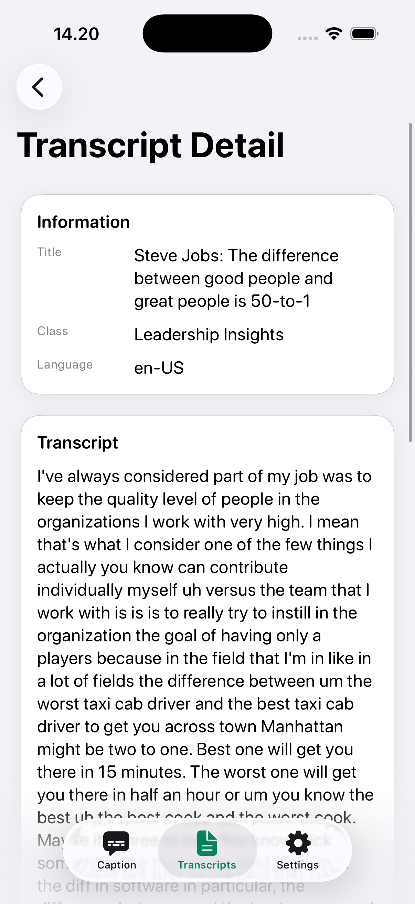
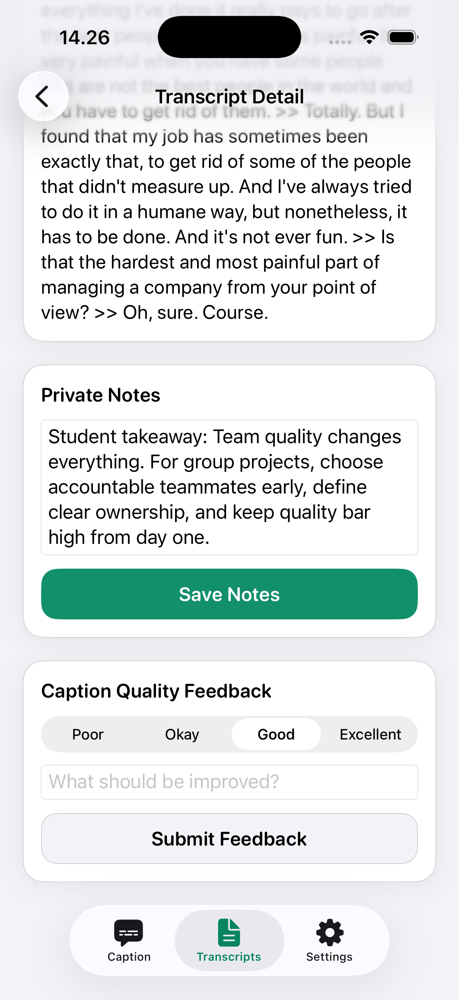
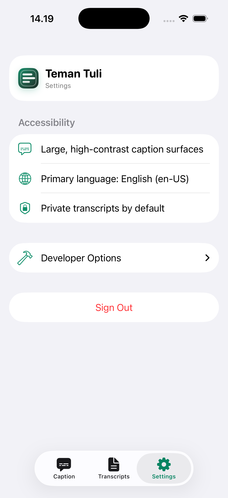

# Teman Tuli

Teman Tuli is an accessibility-first mobile product designed to help Deaf and hard-of-hearing students follow fast classroom discussions through live captions and private transcript sessions.

## Vision
Enable more equitable classroom participation by turning spoken class content into readable, user-controlled learning artifacts.

## Problem Context
In many real classroom situations, Deaf students can lose critical context because:
- speaking pace is too fast,
- discussions overlap and change topic quickly,
- interpreters are not always available,
- shared notes are delayed or incomplete.

This creates learning inequality, reduces confidence during discussion, and increases cognitive load when students try to reconstruct missed content after class.

## Target Users
Primary users:
- Deaf and hard-of-hearing university students.

Secondary stakeholders:
- peers in collaborative class discussions,
- facilitators/lecturers who support accessible learning workflows.

## User Research Highlights
Research artifacts are documented in `docs/evidence/research` and `docs/evidence/iterations`.

Key findings used to shape v1:
- users need **immediate caption visibility** during class,
- text must be **large, readable, and stable** on screen,
- transcript content can include sensitive class information,
- users require explicit control over when transcript data is saved.

Product decisions from these findings:
- live caption is the primary interface,
- transcript persistence is explicit (`Save Private`) and never automatic,
- archived sessions are private-by-default and user-scoped.

## SDG Alignment
Teman Tuli aligns with:
- **SDG 4 — Quality Education**: improves access to classroom content,
- **SDG 10 — Reduced Inequalities**: reduces communication barriers for Deaf students,
- **SDG 3 — Good Health and Well-being** (secondary): reduces stress from repeated context loss.

## Core Product Flow
1. User starts live caption during class.
2. User reads high-visibility real-time text.
3. User stops captioning and explicitly saves transcript.
4. User reviews transcript session, adds notes, and submits quality feedback.

## Core Features
### iOS App (`apps/teman-tuli-ios`)
- Authentication onboarding flow
- Live caption using Apple Speech framework
- Accessibility-first caption display
- Explicit private transcript save
- Transcript archive and session detail
- Personal notes and caption quality feedback submission

### Backend API (`apps/teman-tuli-api`)
- JWT authentication
- Private transcript session CRUD
- Timestamped transcript segment storage
- Caption feedback endpoint for iterative improvement
- Versioned routes under `/api/v1`

## App Screenshots
Latest iOS UI preview (Graphite + Emerald theme, accessibility-first):

| Live Caption Overview | Live Caption Controls |
|---|---|
|  |  |

| Transcript Archive | Transcript Detail |
|---|---|
|  |  |

| Notes & Feedback | Settings |
|---|---|
|  |  |

> Screenshot files are stored in `docs/evidence/screenshots/`.

## Architecture Overview
### Client
- SwiftUI + MVVM
- Apple `Speech` + `AVFoundation`
- Privacy-first local-to-server transcript save workflow

### Server
- Fastify + TypeScript
- Prisma + PostgreSQL
- User-scoped query/update/delete behavior for transcript privacy

## Data Model Summary
Main entities:
- `User`
- `TranscriptSession`
- `TranscriptSegment`
- `CaptionFeedback`

## Privacy & Trust Principles
- Private by default
- No automatic transcript upload during active captioning
- Explicit user action required before backend persistence
- User-scoped access for saved sessions

## Monorepo Structure
- `apps/teman-tuli-ios` — iOS app
- `apps/teman-tuli-api` — backend API
- `docs/evidence` — research, case studies, scripts, iteration logs
- `docs/roadmap-10-weeks.md` — implementation roadmap
- `AGENTS.md` — repository working instructions for coding agents

## Local Development
### Backend
```bash
cd apps/teman-tuli-api
cp .env.example .env
docker compose up -d
npm install
npm run prisma:generate
npm run prisma:deploy
npm run dev
```

### iOS
```bash
cd apps/teman-tuli-ios
xcodegen generate
open TemanTuli.xcodeproj
```

## Validation
Backend checks:
```bash
cd apps/teman-tuli-api
npm test
npm run build
```

## Current v1 Boundaries
- Focused on Bahasa Indonesia speech recognition in classroom usage.
- No public sharing by default (privacy-first scope).
- No cloud transcription dependency in v1.

## Next Iterations
- Improve caption robustness in noisy classroom environments.
- Add consented share-by-class-code workflow.
- Add export options (PDF/Markdown) for study workflows.
- Expand co-creation sessions with target users for post-v1 refinement.
